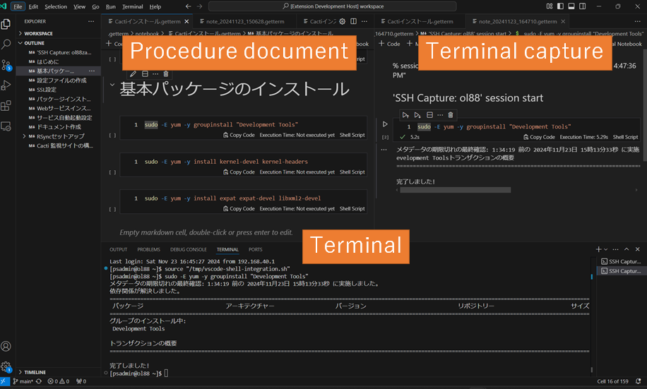

# Getterm: Terminal Capture Tool

Getterm integrates terminal software with a text editor to enhance operational efficiency, particularly for server management tasks. It offers the following key features:



## Features

- **Automation of Terminal Operations and Logs:**  
    Automate the recording of terminal activities, reducing manual intervention.
- **Minimization of Errors in Task Records:**  
    Prevent omissions and errors by streamlining work logs.
- **Command Context and Comments:**  
    Add comments to explain command intentions or document modifications effectively.

## Use Cases

Getterm is designed to optimize terminal usage in server operations by providing the following functionalities:

1. **Deploy Rehearsal:**  
    Capture commands into a task procedure document to simulate and review planned operations.
    
2. **Production Server Deployment:**  
    Automatically log commands during deployment operations, including detailed information such as start and end times, to generate accurate execution reports.


## Installation

Since **Getterm** uses proposed VSCode APIs, it cannot be installed directly from the VSCode Marketplace. Follow the steps below to set up the extension manually:

1. **Download the Getterm Archive**
    
    - Obtain the `getterm-x.x.x.zip` file from the official source or repository.

2. **Extract the Archive**
    
    - Unzip the `getterm-x.x.x.zip` file to access the `getterm-x.x.x.vsix` file.

3. **Install the Remote - SSH Extension**
    
    - Open VSCode Insiders and search for the **Remote - SSH** extension in the Extensions Marketplace.
    - Install the extension to enable remote workspace functionality.

4. **Install the Getterm Extension**
    
    - Open VSCode Insiders.
    - Navigate to the Extensions view by clicking the Extensions icon in the Activity Bar or using `Ctrl+Shift+X`.
    - Click the ellipsis (`...`) in the top-right corner of the Extensions view, then select **Install from VSIX...**.
    - Browse to the location of the `getterm-x.x.x.vsix` file and select it.

## Usage

1. **Start Recording**:
   - Open a terminal in Visual Studio Code.
   - Begin your terminal tasks as usual. The extension will automatically start recording the output.
   
2. **View and Manage Logs**:
   - Use the dedicated **Terminal Logs** view to browse and manage your recorded outputs.
   - Logs are categorized by task or session for easier access.

3. **Export Logs**:
   - Export recorded terminal outputs as reports (e.g., in Excel or JSON formats).
   
4. **Customization**:
   - Adjust settings for recording preferences under the extension's configuration options.

For a visual demonstration, refer to the examples below:


## Contributing

We welcome contributions to this project! Here’s how you can contribute:

1. Clone the repository from GitHub:
   ```bash
   git clone https://github.com/your-repo-name.git
