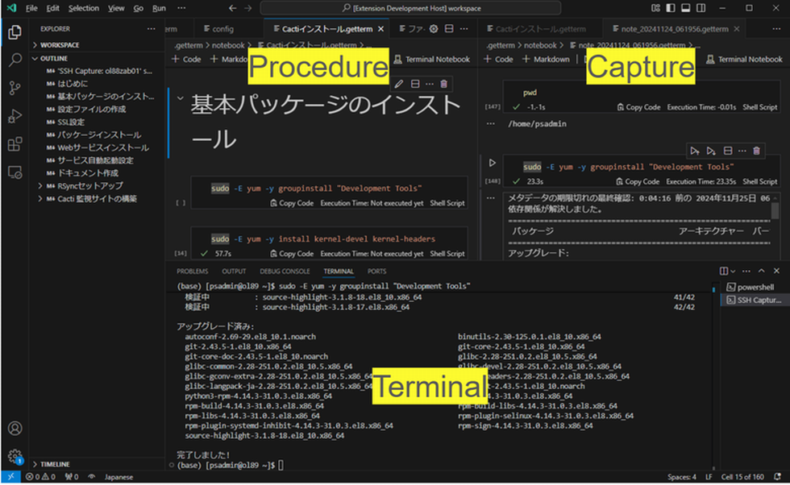

# Getterm: Terminal Capture Tool

Getterm integrates terminal software with a text editor to enhance operational efficiency, particularly for server management tasks. 



## Features

- **Automation of Terminal Operations and Logs:**  
    Automate the recording of terminal activities, reducing manual intervention.

- **Minimization of Errors in Terminal Operations:**  
    Prevent omissions and errors by streamlining work logs.

- **Command Context and Comments:**  
    Add comments to explain command intentions or document modifications effectively.

## Use Cases

Getterm is designed to optimize terminal usage in server operations by providing the following functionalities:

1. **Deploy Rehearsal:**  
    Capture commands into a task procedure document to simulate and review planned operations.
    
2. **Production Server Deployment:**  
    Automatically log commands during production server deployment operations, including detailed information such as start and end times, to generate accurate execution reports.


## Installation

Since **Getterm** relies on proposed APIs available only in ["VSCode Insiders"](https://code.visualstudio.com/insiders), it cannot be installed from the regular VSCode Marketplace. Instead, follow the steps below to set up the extension manually in VSCode Insiders:


1. **Install the ["Remote - SSH"](https://marketplace.visualstudio.com/items?itemName=ms-vscode-remote.remote-ssh) Extension**
    
    - Open ["VSCode Insiders"](https://code.visualstudio.com/insiders) and search for the **Remote - SSH** extension in the Extensions Marketplace.
    - Install the extension to enable remote workspace functionality.

2. **Install the Getterm Extension by .vsix**
    
    - [Download the `getterm.zip`](https://github.com/getperf/getterm/tags) and extract the contents.
    - Open VSCode Insiders.
    - Navigate to the Extensions view by clicking the Extensions icon in the Activity Bar or using `Ctrl+Shift+X`.
    - Click the ellipsis (`...`) in the top-right corner of the Extensions view, then select **Install from VSIX...**.
    - Browse to the location where you extracted the archive downloaded from [getterm-x.x.x.zip](https://github.com/getperf/getterm/tags). Locate the `getterm-x.x.x.vsix` file and select it.

## Usage

### 1. **Run the VSCode Insiders Launch Script**

- Open PowerShell and navigate to the directory where you extracted `getterm-x.x.x.zip`. Then, run the VSCode Insiders launch script:
    
    ```powershell
    cd {path to extracted folder} 
    .\code-getterm.bat .
    ```
    
- This script starts VSCode Insiders with the necessary options to enable the proposed API functionality.
    

### 2. **Connect to a Server**

- Once VSCode Insiders has launched, click on the **Remote - SSH** icon in the Activity Bar.
    
- Right-click on an existing connection host icon and select **Getterm: Open Terminal & Create Notebook** to connect.
    
- It is recommended to configure the connection host to use a public key for authentication, **enabling passwordless login**. In such cases, shell integration will be automatically activated. If automatic login is not possible, you will need to manually load the shell integration script as described in the following notes.

#### Notes:

- For new connections, click the **+** icon next to the SSH host list and register a new connection host.

- After connecting via SSH, the script `shellIntegration-bash.sh` will automatically loaded to enable shell integration APIs.
    
- The `shellIntegration-bash.sh` script appends escape sequences to commands executed in the terminal, signaling events such as start and end times. These sequences are interpreted by VS Code Shell integration API.
    
- If the script fails to load, manually upload `shellIntegration-bash.sh` of current directory to the server and load it with the following command:
    
    ```bash
    source shellIntegration-bash.sh
    ```
    

### 3. **Start Capturing**

- In the notebook toolbar, click **Select Session** and choose the terminal session you wish to record.
- Begin terminal operations. All actions will be logged into the notebook for documentation and review.

## Contributing

We welcome contributions to this project! Here’s how you can contribute:

1. Clone the repository from GitHub:

    ```bash
    git clone https://github.com/getperf/getterm.git
    ```
