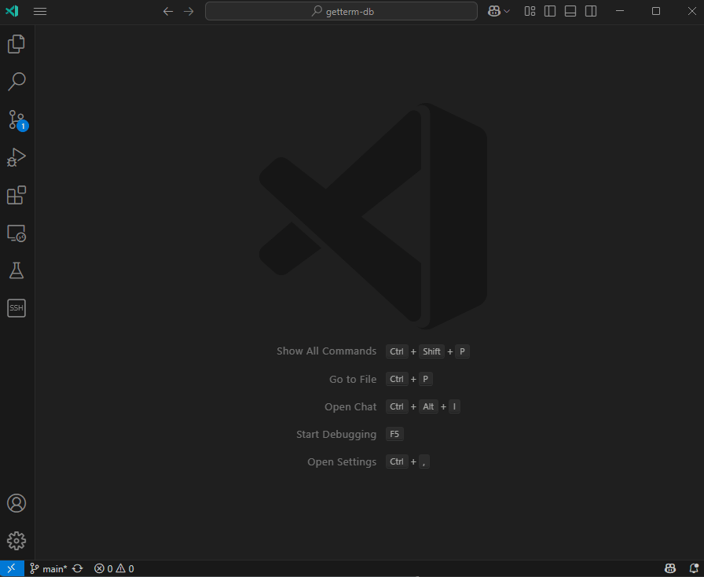

# GetTerm: ターミナルキャプチャーツール

GetTermは、ターミナルとテキストエディタを統合したソフトウェアです。
サーバ管理や運用作業の効率化を目的とし、ターミナル操作の記録とその内容のノートブックへの自動記録を実現します。



サーバ運用におけるターミナル作業を最適化するために以下の機能を提供します。

## 主な機能

1. **ターミナル操作の自動記録**  
    SSH 接続後、ターミナルでの操作をリアルタイムに記録し、その内容をノートブックに反映します。

2. **サーバ手順書の作成**  

    テスト環境での操作シミュレーション結果を自動的に記録し、レビュー用の手順書として活用できます。
    
3. **本番サーバのデプロイ記録**  

    本番環境で実行されるコマンドをログに記録。開始・終了時刻などの詳細情報を含む実行レポートを生成します。

## ショートカットキー

ターミナルとノートブックの連携を支援するため、以下のショートカットキーをご利用ください。

- **CTRL+SHIFT+L**  
    → ノートブックに見出し用の Markdown セルを追加します。  
    （記録内容を整理し、作業区分を明確にするために使用します。）
    
- **CTRL+SHIFT+K**  
    → ターミナルパネルを最大化または元に戻す切り替えを行います。  
    （作業領域を拡大してターミナル操作に集中する際に便利です。）

## インストール

**注意事項**： OpenSSH クライアントが標準で搭載されている Windows 11、Windows Server 2019 以降をサポートします

Getterm は VSCode のプロポーザル API を利用するため、通常版 VSCode ではなく [**VSCode Insiders**](https://code.visualstudio.com/insiders) での利用が必須です。

1. **VSCode Insiders の起動**
    
    - [VSCode Insiders](https://code.visualstudio.com/insiders) をインストールし、起動します。

2. **Getterm 拡張機能のインストール**
    
    - [getterm-x.x.x.zip](https://github.com/getperf/getterm/tags) をダウンロードして解凍します。
    - VSCode Insiders の拡張機能ビュー右上の「…」をクリックし、**Install from VSIX...** を選択します。
    - 解凍したフォルダから `getterm-x.x.x.vsix` を選択してインストールします。

## 使用方法

### 1. **VSCode Insiders 起動スクリプトを実行**
    
- 解凍したフォルダ内にある起動スクリプトを実行してください。  
    
    ```powershell
    .\getterm.bat {作業ディレクトリ(省略可)}
    ```
    
- このスクリプトは、プロポーザル API 機能を有効にした状態で VSCode Insiders を起動します。
        
### 2.**サーバーに接続してノートブックを作成する**
    
- 起動後、アクティビティバーの **SSH** アイコンをクリックします。
    
- 既存の接続ホストアイコンを右クリックして **Getterm: Open Terminal & Create Notebook** を選択し、対象ホストに SSH 接続します。

- 選択したホストに対して SSH 接続が開始され、シェル統合スクリプトが自動でロードされます。

### 3. **ターミナル操作の記録開始** 

- SSH 接続後、ターミナルでの操作が自動的に記録され、内容がノートブックに反映されます。
- ターミナルおよびノートブックを操作する際は、以下のショートカットキーも併用してください：

    - CTRL-SHIFT-L : ノートブックに見出し用の Markdown セルを追加します。
    - CTRL-SHIFT-K : ターミナルパネルの最大化／元に戻す（On/Off）切り替えを行います。

## 注意事項

- 新規接続の場合は  **SSH** ナビゲーションビューを開き、SSH の行の右側の + をクリックし、新規接続ホストを登録してください。
    
- SSH 接続後、自動で `vscode-shell-integration.sh` を読み込み、シェル統合APIを有効化します。
    
- `vscode-shell-integration.sh` は コマンドの実行時に開始・終了などを示すイベントのエスケープシーケンスを追加します。VS Code は本エスケープシーケンスを読み取りシェル統合 API と連携します。
    
- シェル統合を永続化するには、.bash_profile に次の行を追加してください:

    ```bash
    vi ~/.bash_profile
    # 最終行に以下を追加
    source "${HOME}/.getterm/vscode-shell-integration.sh"
    ```

## コマンド

### 基本操作

- **`getterm-db.setLogLevel`**  
    **タイトル:** Getterm: Set Log Level  
    **説明:**  
    ログ出力レベルを設定します。デバッグ時の情報確認に利用します。
    
- **`getterm-db.showRemoteSSHView`**  
    **タイトル:** Getterm: Show remote SSH view  
    **説明:**  
    ナビゲーションビューに Remote-SSH の接続ホストリストを表示します。
    

### SSH 接続

VSCodeの左側のバー (Activity Bar) から、Remote Explorer を選択してホスト一覧を表示し、接続ホストを選択して右クリックしてコマンドを実行してください。

- **`getterm-db.openTerminalWithProfile`**  
    **タイトル:** Getterm: Open Terminal  
    **説明:**  
    対象ホストを右クリックし、**[Getterm: Open Terminal]** を選択すると、選択したプロファイルに基づいて SSH 接続が開始され、ターミナルが起動します。
    
- **`getterm-db.openTerminalWithProfileAndCreateNotebook`**  
    **タイトル:** Getterm: Open Terminal & Create Notebook  
    **説明:**  
    対象ホストを右クリックし、**[Getterm: Open Terminal & Create Notebook]** を選択すると、SSH 接続が確立されると同時に新規ノートブックが作成され、ターミナル操作が自動的に記録されます。
    
### 端末操作

- **`getterm-db.startTerminalCapture`**  
    **タイトル:** Getterm: Start Terminal Capture  
    **説明:**  
    ターミナルパネル右側の端末リストを選択し、**右クリック** -> [**Getterm: Start Terminal Capture**] でターミナル出力のキャプチャーを開始します。キャプチャーした操作内容は、後でノートブックに記録されます。

- **`getterm-db.loadShellIntegrationScript`**  
    **タイトル:** Getterm: Load shell integration script  
    **説明:**  
    シェル統合スクリプトをロードし、リモートホスト側のシェル統合機能を有効化します。  
    （suコマンドによるユーザー切り替えなどでシェル環境が変更された場合に再実行します。）

### ノートブック操作

- **`getterm-db.createNewTerminalNotebook`**  
    **タイトル:** Getterm: Create new terminal notebook  
    **説明:**  
    端末操作記録用の新規ノートブックを作成します。

- **`getterm-db.selectSession`**  
    **タイトル:** Select Session  
    **カテゴリー:** Notebook  
    **説明:**  
    ノートブックのメニューから、[**Select Session**] -> [**ターミナル名**] を選択し、端末接続と同時に記録を開始します。
    
- **`getterm-db.stopCapture`**  
    **タイトル:** Stop Capture  
    **カテゴリー:** Notebook  
    **説明:**  
    ノートブックのメニューから [**Stop Capture**] を選択し、
    端末セッションのキャプチャーを停止します。記録の終了と端末セッションの切断を行います。
    
- **`getterm-db.addMarkdownCell`**  
    **タイトル:** GetTerm: Add Markdown Header  
    **説明:**  
    ショートカット（CTRL+SHIFT+L）で実行され、ノートブックに見出し用の Markdown セルを追加します。
    
- **`getterm-db.maximizeTerminalPanel`**  
    **タイトル:** Maximize Terminal Panel  
    **説明:**  
    ショートカット（CTRL+SHIFT+K）で実行され、端末パネルのサイズを最大化／元に戻すトグル操作を行います。端末作業に集中したい場合は最大化します。

### エクスポート操作

- **`getterm-db.exportExcel`**  
    **タイトル:** Getterm: Export to excel  
    **説明:**  
    ノートブックの内容を Excel 形式にエクスポートします。データの集計や作業レビューに利用します。
    
- **`getterm-db.exportMarkdown`**  
    **タイトル:** Getterm: Export to markdown  
    **説明:**  
    ノートブックの内容を Markdown 形式にエクスポートします。ドキュメントとして再利用したり、Web に展開する際に便利です。
       
## 貢献方法

このプロジェクトへの貢献を歓迎します！以下の手順で参加できます：

GitHub リポジトリからソースコードをクローンし、プルリクエストや Issue を通じてフィードバックをお寄せください。

    ```bash
    git clone https://github.com/getperf/getterm.git
    ```
