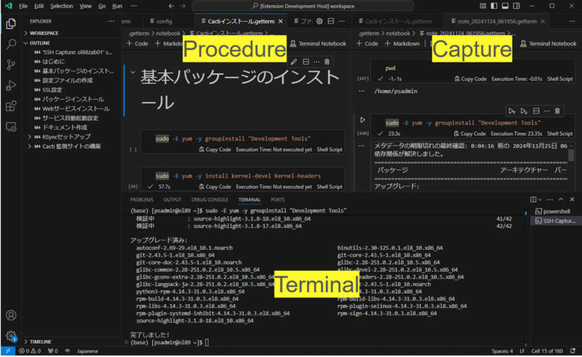

# Getterm: ターミナルキャプチャーツール

Gettermは、ターミナルソフトウェアとテキストエディタを統合し、特にサーバ管理タスクの運用効率を向上させることを目的としたツールです。



## 特徴

- **ターミナル操作とログの自動化**  
    ターミナルでの作業を自動記録し、手動の介入を削減します。
    
- **ターミナル操作におけるエラーの最小化**  
    作業ログを簡素化し、手順の抜け漏れやエラーを防ぎます。
    
- **コマンドの意図やコメント追加**  
    コマンドの意図や変更内容を効果的に記録できるコメントを追加できます。
    

## 使用例

Gettermは、サーバ運用におけるターミナル作業を最適化するために以下の機能を提供します。

1. **デプロイのリハーサル**  
    テスト環境で予定されている操作をシミュレーションし、レビュー用のタスク手順書としてコマンドを記録します。
    
2. **本番サーバのデプロイ**  
    本番環境でのデプロイ作業中にコマンドを自動的にログに記録し、開始時間や終了時間などの詳細情報を含む正確な実行レポートを生成します。
    

## インストール

**Getterm**は、[ VSCode Insiders ](https://code.visualstudio.com/insiders)で利用可能なプロポーサル API を使用するため、通常の VSCode Marketplace からはインストールできません。以下の手順で、VSCode Insiders を起動して手動でセットアップしてください。

1.  **[Remote - SSH](https://marketplace.visualstudio.com/items?itemName=ms-vscode-remote.remote-ssh) 拡張機能をインストール**
    
    - [ VSCode Insiders ](https://code.visualstudio.com/insiders)を開き、拡張機能マーケットプレイスで [**Remote - SSH**](https://marketplace.visualstudio.com/items?itemName=ms-vscode-remote.remote-ssh) を検索してインストールします。
    
2. **Getterm拡張機能をインストール**
    
    - [`getterm.zip`](https://github.com/getperf/getterm/tags)をダウンロードして解凍します。
    - VSCode Insiders を開きます。
    - アクティビティバーの拡張機能アイコンをクリックするか、`Ctrl+Shift+X`（macOSでは`Cmd+Shift+X`）を使用して拡張機能ビューに移動します。
    - 拡張機能ビューの右上にある省略記号（`...`）をクリックし、**Install from VSIX...**を選択します。
    - 解凍したアーカイブの場所に移動し、`getterm-x.x.x.vsix`ファイルを選択してください。

これでGettermがインストールされ、使用可能になります。詳細な使用方法については、以下の**Usage**セクションを参照してください。

## 使用方法

### 1. **VSCode Insiders 起動スクリプトを実行**
    
- PowerShell を開き、`getterm-x.x.x.zip` を解凍したディレクトリに移動し、 VSCode Insiders の起動スクリプトを実行します。
    
    ```powershell
    cd {解凍先のパス}
    .\code-getterm.bat .
    ```
    
- このスクリプトは、プロポーザルAPI機能を有効化するオプションを追加して、 VSCode Insiders を起動しています。
        
### 2.**サーバーに接続する**
    
- 起動後、アクティビティバーの **Remote - SSH** アイコンをクリックします。
    
- 既存の接続ホストアイコンを右クリックして **Getterm: Open Terminal & Create Notebook** を選択し、対象ホストに接続します。

#### 注意事項

- 新規接続の場合は SSH の行の右側の + をクリックし、新規接続ホストを登録してください。
    
- SSH 接続後、自動で `shellIntegration-bash.sh` を読み込み、シェル統合APIを有効化します。
    
- `shellIntegration-bash.sh` は コマンドの実行時に開始・終了などを示すイベントのエスケープシーケンスを追加します。VS Code は本エスケープシーケンスを読み取りシェル統合 API と連携します。
    
- スクリプトの読み込みがエラーとなった場合は、カレントディレクトリにある `shellIntegration-bash.sh` を手動でアップロードして読み込んでください。
    
    ```bash
    # shellIntegration-bash.shをホストにアップロードして読み込み
    source shellIntegration-bash.sh
    ```
        
### 3. **キャプチャを開始する**
    
- ノートブック上部のメニューから **Select Session** を選択し、記録する端末名を選択します。
- ターミナル操作の記録が開始され、操作内容がノートブックに記録されます。
